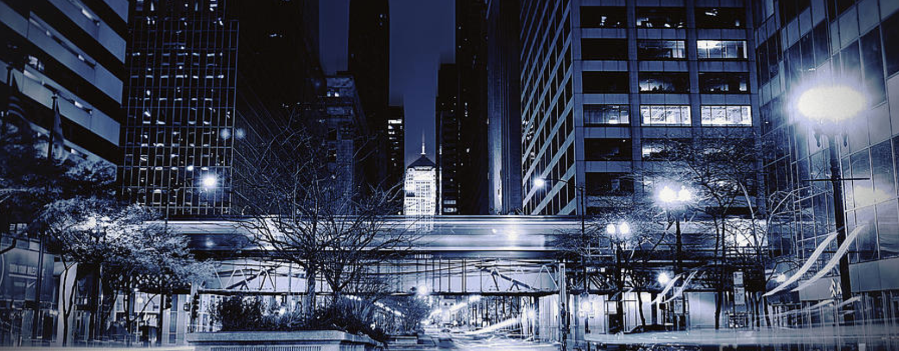

# Chicago Crime

##  Problem statement

To distill information that would be of utility and benefit to those individuals and organizations that have as their intent the desire and willingness to improve life in the City of Chicago.

## Executive Summary

To gather and use data to make informed decisions, guide behavior, and improve outcomes  --  whether for an individual or an institution -- is the raison d'etre for data science.  The historical images of Al Capone to the current rendering of "Chi-raq" makes for a highly charged atmosphere, with openings to inflame emotions or distort realities.  The use of reason, science, and an exploratory spirit to dive into volumes of raw crime data to hopefully (but without guarantees) extract meaningful insights was the motivating driver.

The largest overarching theme that was discovered, and gives rise to good confidence that the results could be employed to individuals' and the City's benefit,  was the cyclic nature criminal acts.  When combined with knowledge of (a) different types of crimes having different likelihoods at various hours of the day and (b) each local district's distributions of offense types,  creative ideas both grandiose and more modest can be implemented.

In one sentence, the overall crime rate has shifted slightly down during the seven year interval studied November 2012 to Nivember 2019, with the majority in the first two years and a more steady state since.

Overall cycles or trends identified, together with each one's 'period':

  1) Yearly cycle: troughs in February, peaks in August, returning to trough in February
  
